# DVWA Ethical Hacking Lab

## Overview
Penetration test conducted against DVWA (Damn Vulnerable Web Application) in an isolated VirtualBox lab environment.

| Machine | OS | IP | Role |
|---|---|---|---|
| Kali Linux | Kali 2026.1 | 192.168.56.102 | Attacker |
| Metasploitable 2 | Ubuntu | 192.168.56.101 | Victim |

## Attack Phases

### Phase 1 — Reconnaissance
- Ping sweep to discover all live hosts on the network
- Identified target at 192.168.56.101
- Tool: `nmap -sn 192.168.56.0/24`

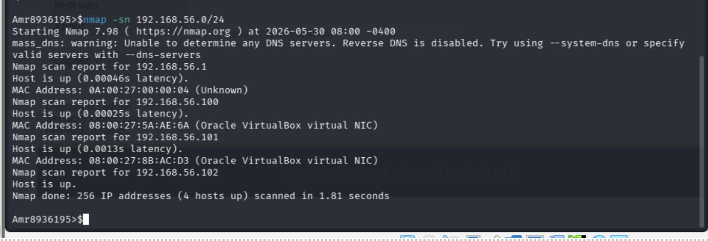

### Phase 2 — Scanning & Enumeration
- Full port scan with service and version detection
- OS fingerprinting
- Vulnerability scanning with NSE scripts
- Discovered: Apache, MySQL, FTP, SSH, Telnet, Samba
- Tool: `nmap -sV -sC -A -O`

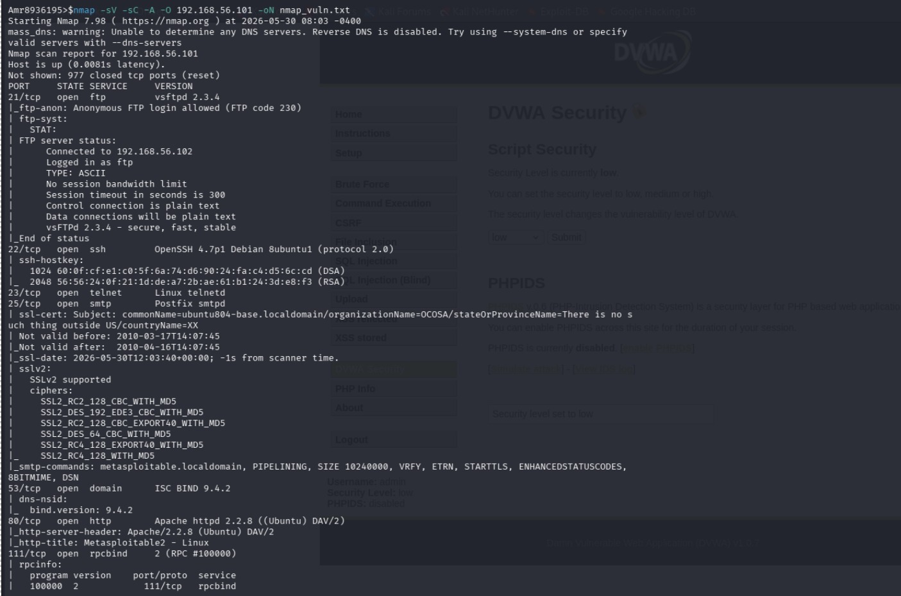
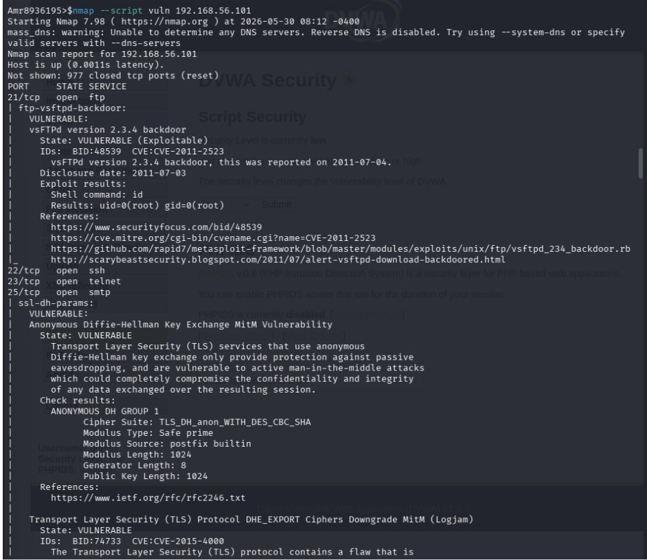

### Phase 3 — Network Traffic Capture (ARP Poisoning MITM)
- Performed ARP poisoning between victim (192.168.56.101) and gateway (192.168.56.1)
- Positioned Kali as man-in-the-middle to intercept all traffic
- Captured plaintext HTTP login credentials via Wireshark
- Tools: `arpspoof`, `Wireshark`

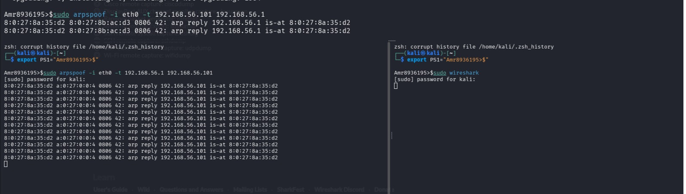
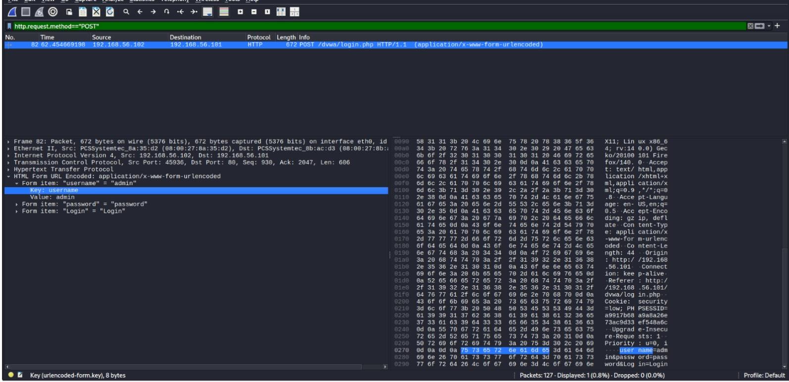

### Phase 4 — Exploitation

#### SQL Injection
- Manually injected payload to dump all database users
- Extracted MD5 password hashes using UNION attack

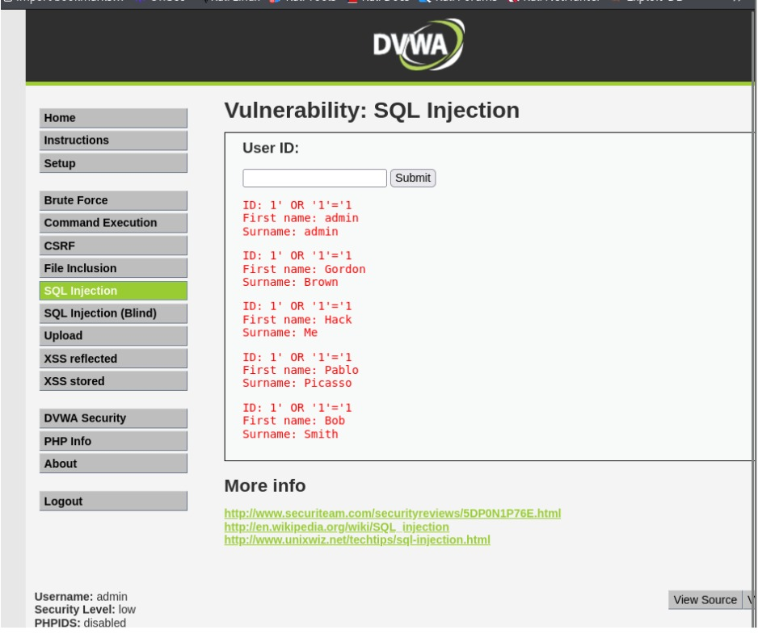
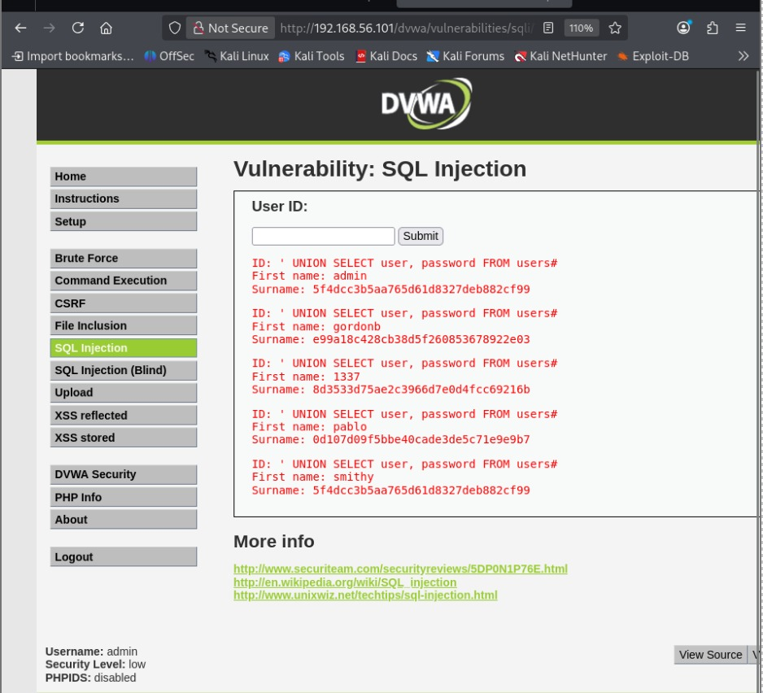

#### Cross-Site Scripting (XSS)
- Reflected XSS: injected script executed in browser
- Stored XSS: persistent script saved in database

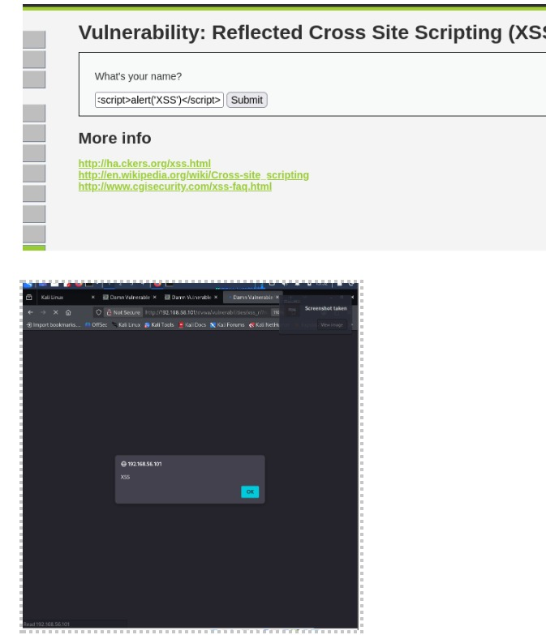
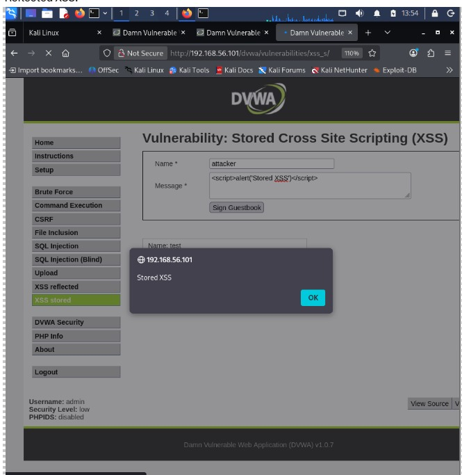

#### Command Injection
- Injected OS commands through web form
- Read sensitive system file /etc/passwd

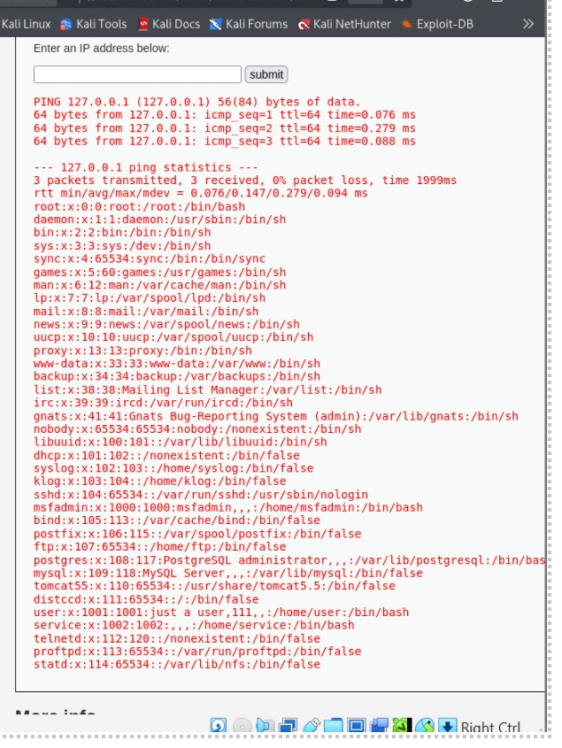

#### Brute Force
- Automated password attack using Hydra
- Found 16 valid passwords for admin account
- Tool: `Hydra` + `rockyou.txt`

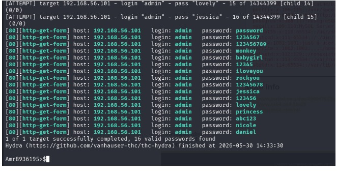

### Phase 5 — Post Exploitation
- Cracked all stolen MD5 hashes using John the Ripper
- Recovered plaintext passwords for all users
- Tool: `john` + `rockyou.txt`

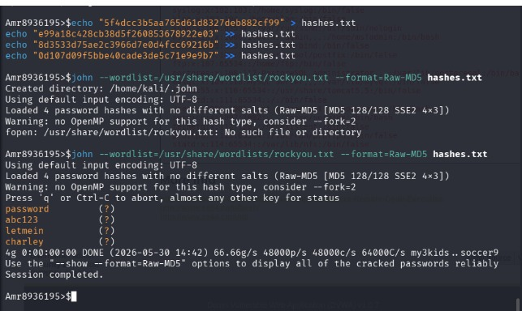

## Vulnerabilities Found

| Vulnerability | Severity | CWE | Fix |
|---|---|---|---|
| SQL Injection | Critical | CWE-89 | Use prepared statements |
| XSS Reflected | High | CWE-79 | Output encoding |
| XSS Stored | High | CWE-79 | Input sanitization |
| Command Injection | Critical | CWE-78 | Never pass input to shell |
| Weak Passwords | Medium | CWE-521 | Enforce password policy |
| Cleartext HTTP | High | CWE-319 | Use HTTPS |

## Tools Used
| Tool | Purpose |
|---|---|
| nmap | Reconnaissance and scanning |
| Wireshark | Traffic capture and analysis |
| arpspoof | ARP poisoning MITM attack |
| Hydra | Brute force password attack |
| John the Ripper | Password hash cracking |

## Disclaimer
This project was conducted in an isolated lab environment for educational purposes only. All attacks were performed on intentionally vulnerable software. No real systems were affected.
